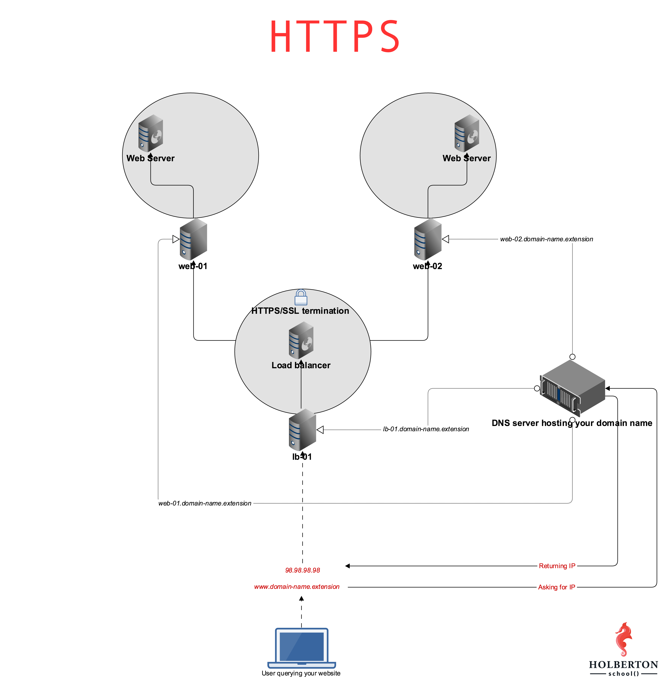

### Concepts Learned 
    - What is HTTPS? [here]:(https://docs.ionos.com/cloud)
    - What are the 2 main elements that SSL is providing: [here]:(https://www.sslshopper.com/why-ssl-the-purpose-of-using-ssl-certificates.html)
    - HAProxy SSL termination on Ubuntu16.04: [here]:(https://docs.ionos.com/cloud)
    - SSL termination: [here]:(https://en.wikipedia.org/wiki/TLS_termination_proxy)
    - Bash function: [here]:(https://tldp.org/LDP/abs/html/complexfunct.html)

    